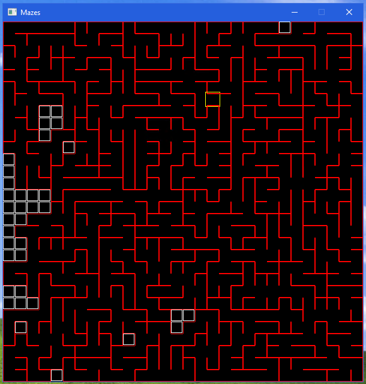
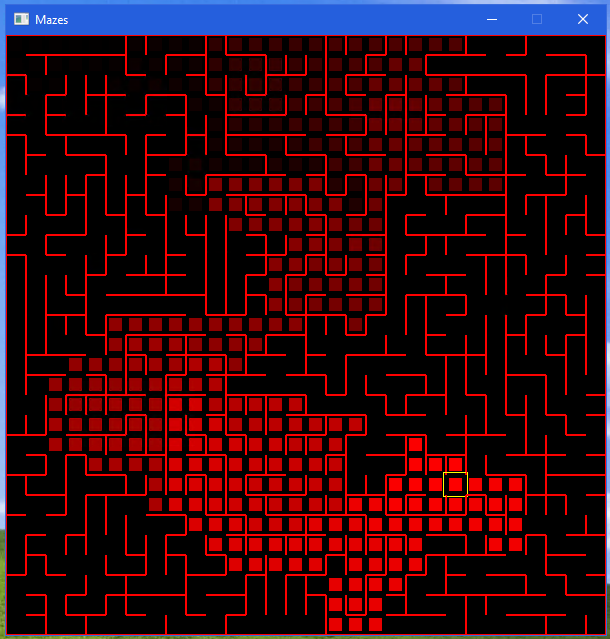

# Mazes 
Generate and solve mazes 

## Generating

Using AldousBroder
1. pick a start cell
2. choose a neighbour
3. if neighbour not yet visited add a path between the two cells
4. repeat from 2 until all cells visited

## Solving

Using wall follower

